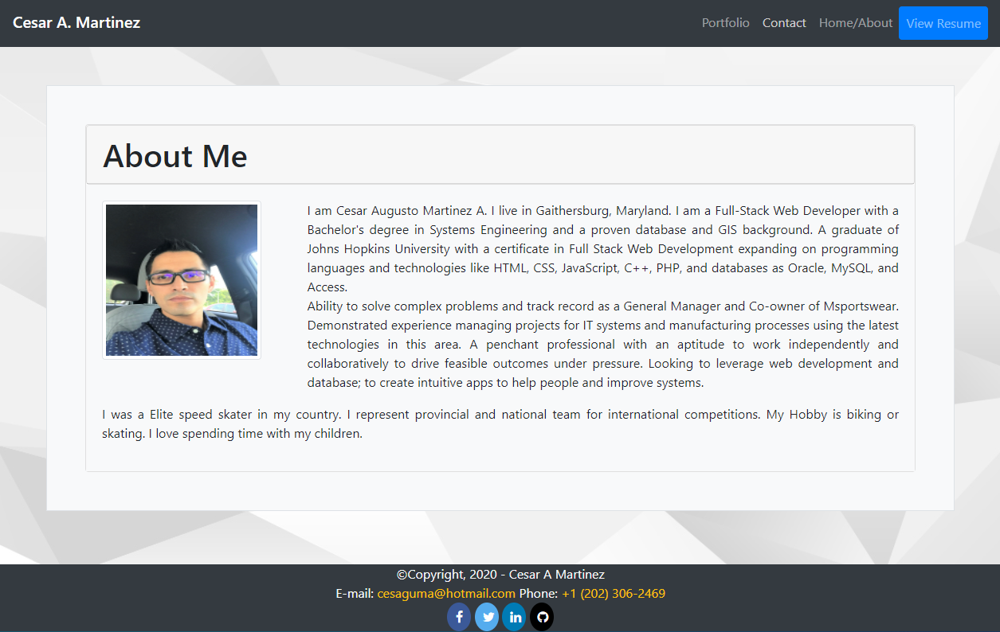
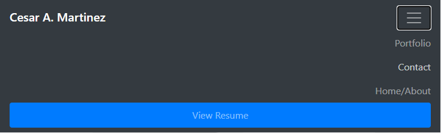

# Portfolio



Link : [Project Link](https://cesaraugustomartinez.github.io/Portfolio/)

---

### Table of Contents

- [Description](#description)
- [How to Use](#how-to-use)
- [Screenshots](#screenshots)
- [References](#references)
- [License](#license)
- [Author Info](#author-info)

---

## Description

The goal of this project is the use of Bootstrap CSS Framework to create a mobile responsive portfolio. A Bootstrap's grid system has been implemented to add styling which delivers a very good look to the user. Elements as container, rows, and columns were used in the develoment of this project as well. 

##### Technologies

- Html
- Javascript
- Visual Studio Code
- CSS
- Bootstrap

Code sample - Html

```html

<link rel="stylesheet" href="https://stackpath.bootstrapcdn.com/bootstrap/4.5.2/css/bootstrap.min.css" integrity="sha384-JcKb8q3iqJ61gNV9KGb8thSsNjpSL0n8PARn9HuZOnIxN0hoP+VmmDGMN5t9UJ0Z" crossorigin="anonymous">
  <link rel="stylesheet" href="assets/css/styles.css">
  <link rel="stylesheet" href="https://cdnjs.cloudflare.com/ajax/libs/font-awesome/4.7.0/css/font-awesome.min.css">

```

Code sample - JavaScript

```js

$(document).ready(function(){
    //$('.carousel').carousel()
    $('.carousel').carousel({
        interval: 3000
      })
  });

```

Code sample - CSS

```css

body {
    background: url("../images/body-bg.png") no-repeat center center fixed;
    -webkit-background-size: cover;
    -moz-background-size: cover;
    background-size: cover;
    -o-background-size: cover;
  }
#imgsize {
  width: 200px;
  height: 200px;
}
  
```

---

## How To Use

This web application has three webpages. These have different types of information. Each of them have elements like menu, photos, links, social media buttons. You can interact between these three wepages going from one to oher one easy. Also you can access to them through mobile, desktop and tablet devices, having a responsive website. 

## Screenshots

- Navbar


- Navbar for Small Displays



- Footer with social media buttons


- Contact Form


- Portfolio Grid System for Projects 


[Back To The Top](#Portfolio)

---

## References

- w3school -- [Bootstrap 4 Tutorial](https://www.w3schools.com/bootstrap4/)
- Bootstrap -- [Grid system](https://getbootstrap.com/docs/4.5/layout/grid/)

[Back To The Top](#Portfolio)

---

## License

Copyright (c) [2020] [Cesar A Martinez]

[Back To The Top](#Portfolio)

---

## Author Info

- Twitter -- [@cesaguma](https://twitter.com/cesaguma)
- Linkedin -- [Cesar A Martinez](https://www.linkedin.com/in/cesar-augusto-martinez-auquilla-03934a16b/)

[Back To The Top](#Portfolio)
